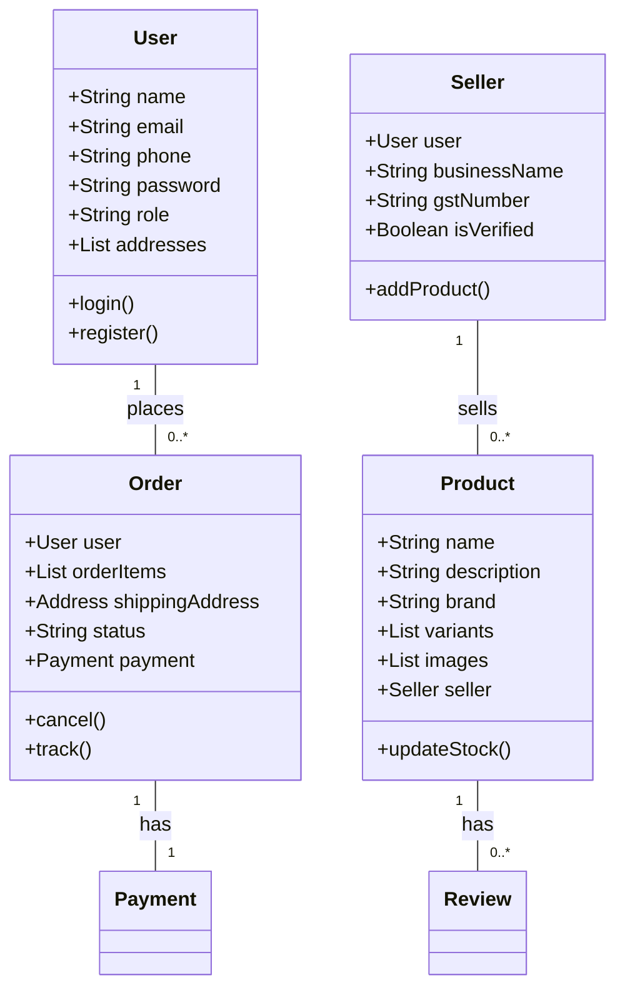
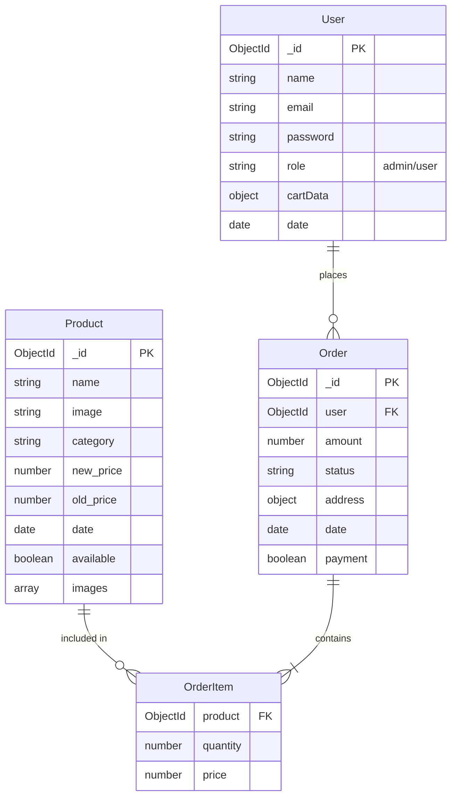

# Flipkart-level E-Commerce System Architecture

## 1. High-Level Architecture

The system follows a **Monolithic Architecture** (initially) with a clear separation of concerns, designed to be easily refactored into **Microservices** as it scales.

```mermaid
graph TD
    subgraph Client [Frontend (React + Vite)]
        UI[User Interface]
        Router[React Router]
        Context[ShopContext (State)]
        API_Service[API Service (Axios)]
        
        UI --> Router
        Router --> UI
        UI --> Context
        UI --> API_Service
    end

    subgraph Server [Backend (Node.js + Express)]
        Auth_C[Auth Controller]
        Prod_C[Product Controller]
        Order_C[Order Controller]
        Pay_C[Payment Controller]
        Middleware[Auth Middleware]
        
        API_Service -- HTTP/JSON --> Auth_C
        API_Service -- HTTP/JSON --> Prod_C
        API_Service -- HTTP/JSON --> Order_C
        API_Service -- HTTP/JSON --> Pay_C
        
        Auth_C --> Middleware
        Order_C --> Middleware
    end

    subgraph Database [MongoDB]
        Users[(Users Collection)]
        Products[(Products Collection)]
        Orders[(Orders Collection)]
        
        Auth_C --> Users
        Prod_C --> Products
        Order_C --> Orders
        Order_C --> Users
    end

    subgraph External [External Services]
        Stripe[Stripe Payment Gateway]
    end

    Pay_C -- Payment Intent --> Stripe
    Client -- Card Details --> Stripe
```

### Tech Stack
- **Frontend**: React (Vite), Redux Toolkit, Tailwind CSS
- **Backend**: Node.js, Express.js
- **Database**: MongoDB (Mongoose ODM)
- **Caching**: Redis (for product listings, sessions)
- **Search**: MongoDB Atlas Search or ElasticSearch (mocked for now)
- **Storage**: Cloudinary / AWS S3 (for images)
- **Payment**: Stripe, Razorpay

### System Components
1.  **Client App (SPA)**: Handles UI, State Management (Redux), and API calls.
2.  **API Gateway / Load Balancer**: (Nginx/Express) Routes requests, handles Rate Limiting.
3.  **Core Services**:
    *   **Auth Service**: JWT, OTP, Role-based Access Control (RBAC).
    *   **Product Service**: Catalog, Inventory, Search.
    *   **Order Service**: Cart, Checkout, Order Lifecycle.
    *   **User Service**: Profile, Address, Wishlist.
    *   **Seller Service**: Merchant dashboard, KYC, Analytics.
4.  **Background Workers**: Email notifications, Order processing, Analytics aggregation.

---

## 2. UML Diagrams

### A. Use Case Diagram (Textual Representation)
*   **Guest**: Search Products, View Details, Add to Cart, Register/Login.
*   **Customer**: Manage Profile, Manage Address, Place Order, Track Order, Rate Product, Return/Exchange.
*   **Seller**: Register, Upload KYC, Add Products, Manage Inventory, View Sales, Process Orders (Packaging).
*   **Admin**: Manage Users/Sellers, Approve KYC, Site-wide Analytics, Manage Categories, Handle Disputes.

### B. Class Diagram (Key Entities)



### C. Sequence Diagram: Place Order Flow

1.  **User** -> **Frontend**: Clicks "Place Order"
2.  **Frontend** -> **Order API**: POST /api/orders
3.  **Order API** -> **Product Service**: Check Stock (Lock Inventory)
4.  **Order API** -> **Payment Gateway**: Create Payment Intent
5.  **Payment Gateway** -> **Frontend**: Return Payment Token
6.  **Frontend** -> **Payment Gateway**: Confirm Payment
7.  **Payment Gateway** -> **Order API**: Webhook (Payment Success)
8.  **Order API** -> **Database**: Create Order, Deduct Stock
9.  **Order API** -> **Notification Service**: Send Email/SMS
10. **Order API** -> **Frontend**: Return Order Success

---

## 3. ER Diagram (Entity Relationship)


